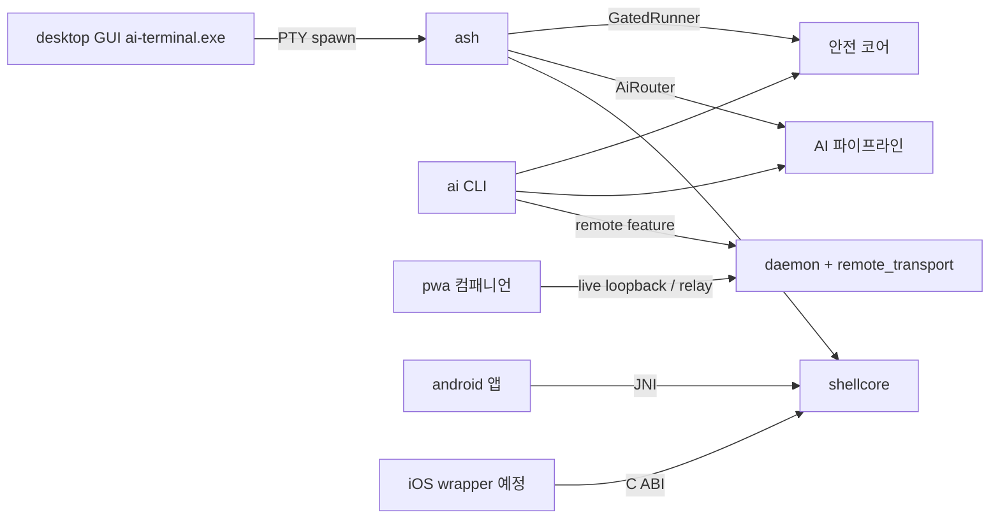

# ARCHITECTURE — ai-cli-terminal 구조 지도

워크스페이스 전체를 한 장으로 파악하기 위한 문서. 상세 이력은 HISTORY.md,
재개점은 HANDOFF.md, 백로그는 TASK.md.

## 1. 워크스페이스 레이아웃

- `D:\workspace\terminal-project\` — 작업 루트(**git 밖**). `document/`(설계 정본
  v3.3, 역사적), `docs/`(초기 브레인스토밍, 역사적), `scripts/`, 루트 README.
- `terminal/` — **유일한 git 레포이자 구현 정본**(이 문서가 있는 곳).

## 2. 제품 표면 (2026-07-08)

| 표면 | 위치 | 스택 | 규모 |
|---|---|---|---|
| `ai` CLI | `src/main.rs` + 도메인 모듈 | Rust | 서브커맨드 ~25개 |
| `ash` 셸 | `src/bin/ash.rs` + `src/shellcore/` | Rust(순수, android 공유) | lexer/parser/ast/engine/builtins |
| 데스크톱 GUI | `desktop/` | Tauri 2 + TS + xterm.js | 릴리스 자산 `ai-terminal.exe` |
| PWA 승인 컴패니언 | `pwa/` | 바닐라 JS + WebCrypto | approve/reject·relay setup |
| Android 앱 | `android/` | Kotlin/Compose + JNI | shellcore cdylib 사용 |
| iOS 기판 | `src/mobile_ffi.rs` | C ABI cdylib | Xcode 프로젝트 없음(경계 문서 참조) |
| Relay | `src/remote_transport/`·`src/daemon/` | Rust(+`tls`) | self-hosted green, managed는 scaffold |
| 검증 게이트 | `scripts/` + `package.json` | PowerShell/Node | check:*/smoke:* |

## 3. Rust 모듈 클러스터 (src/, 평면 55모듈)

| 클러스터 | 모듈 |
|---|---|
| 안전 코어 | risk, policy, mask, preview, diff, undo, guardrails, gate, gated_runner, shell_audit, sandbox, verify |
| AI 파이프라인 | gateway, intent, dispatch, cache, ollama, openai, provider, responder, ai_router, ai_usage, aitask, planner, index, skill, mcp, context, explain, tokenwin, verify_agent |
| 셸·PTY | shell, shellcore/, pty, ui, wrapper, line_editor, cmdparse, pipeline |
| 원격 승인(RA) | remote, remote_transport, approval, daemon, device_registry, pairing, qr, session, http |
| trust 채널(P3, in-flight PR #68~80) | trust, policy_d, skill_registry, binary_manifest |
| 모바일 | mobile, mobile_ffi, mobile_jni(android 전용) |
| 인프라 | config, store, lock, usage, main.rs, lib.rs |

## 4. feature·타깃 게이트

| gate | 내용 | 이유 |
|---|---|---|
| default | C-free 코어 | 어디서나 빌드 |
| `storage` | rusqlite(bundled) | C 컴파일러 필요 |
| `tls` | tokio-rustls/ring, HTTPS·WSS | C 컴파일러 필요 |
| `remote` | Noise XX + Ed25519 원격 승인 | 순수 Rust, 경량화 목적 게이트 |
| `trust` | P3 서명 검증(스택 머지 후 main 진입) | 순수 Rust |
| `cfg(not(android))` | 데스크톱 전용 모듈·의존(ratatui/crossterm/portable-pty/reedline) | android cdylib은 shellcore+mobile만 |
| `cfg(unix)` | daemon(Unix 소켓) | Windows 미지원 |

## 5. 표면 관계

## 6. 빌드·검증

- Rust 툴체인은 WSL(Ubuntu). Windows host는 PowerShell 스모크·패키징 담당.
- CI(`.github/workflows/ci.yml`): fmt·clippy·test / cargo audit / android JNI
  packaging / windows build. **desktop(Tauri)은 release.yml에서만 빌드**된다.
- 검증 명령·함정(파이프 마스킹, WSL 경로 등)은 HANDOFF.md §4와 Claude 메모리
  `terminal-build-env` 참조.

## 7. 유지 규칙

표면·클러스터·게이트가 바뀌는 PR은 이 문서의 해당 표를 같은 PR에서 갱신한다.
수치(모듈 수 등)는 정확값 대신 근사로 유지해도 된다 — 표의 **구조**가 정본이다.
