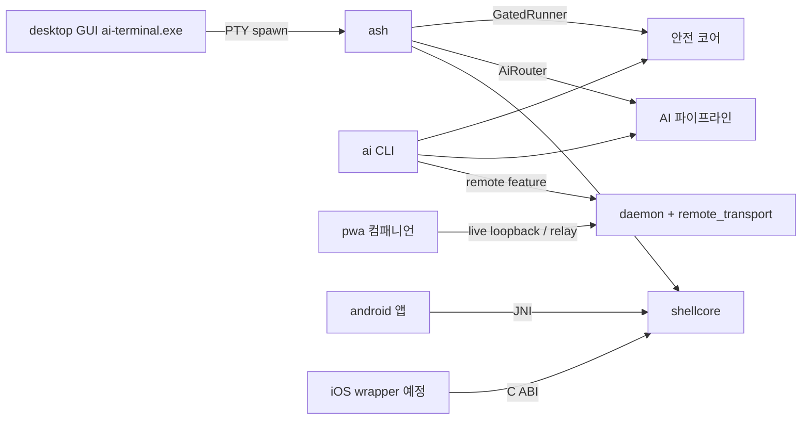

# Workspace Refactoring Wave 1 Implementation Plan

> **For agentic workers:** REQUIRED SUB-SKILL: Use superpowers:subagent-driven-development (recommended) or superpowers:executing-plans to implement this plan task-by-task. Steps use checkbox (`- [ ]`) syntax for tracking.

**Goal:** 스펙 `docs/superpowers/specs/2026-07-08-workspace-refactoring-review-design.md`의 Wave 1 — 루트 잔재 제거, 구조 지도·인덱스 문서 신설, trust 스택과 무충돌인 거대 파일 3곳(desktop, daemon.rs, remote_transport.rs) 분할.

**Architecture:** 모든 코드 태스크는 behavior-preserving 이동이다. 새 기능 없음. 각 태스크는 독립 브랜치→PR 1개로 완결되고, 기존 테스트 스위트 green이 회귀 검증이다. Rust 분할은 "디렉토리 모듈 + mod.rs re-export로 공개 경로 불변" 패턴, TS 분할은 "ESM 모듈 분리 + main.ts 결선" 패턴.

**Tech Stack:** Rust(2021, WSL 툴체인), TypeScript+Vite+Tauri 2(desktop), git/gh CLI, PowerShell(Windows host).

## Global Constraints

- **동작 보존**: 로직 수정 금지. 허용되는 변경은 ① 코드 블록 이동 ② `mod`/`use`/`import`/`export` 선언 ③ 가시성 승격(`pub(crate)`/`pub(super)`, TS `export`) ④ rustfmt/이동에 따른 공백뿐이다.
- **기준 브랜치**: 모든 작업 브랜치는 `main`에서 분기, PR base도 `main`(스펙 §9.4 승인된 기본값). 브랜치명 `refactor/wave1-<slug>`.
- **머지 게이트**: PR CI 4잡 green 확인 전 머지 금지. 머지는 컨트롤러/사용자 승인 후.
- **`git add -A` 금지** — 파일을 명시해 stage한다(레포 규칙).
- **모든 git/파일 명령은 절대경로 또는 `git -C D:\workspace\terminal-project\terminal`** (에이전트 스레드는 bash 호출 사이 cwd 리셋).
- **Rust 검증은 WSL 단일라인 래퍼**(멀티라인 전달 금지):
  `MSYS_NO_PATHCONV=1 wsl.exe -- bash -lc 'source ~/.cargo/env; cd /mnt/d/workspace/terminal-project/terminal; export CARGO_TARGET_DIR=$HOME/targets/ai-terminal; <cmd> && echo PASS || echo FAIL'`
  판정은 파이프 없이 `&& echo PASS || echo FAIL` 제어흐름으로만(파이프 마스킹 함정). `false`→FAIL이 sanity check.
- **feature 매트릭스(main 기준)**: `storage` / `tls` / `remote` (trust는 스택 미머지 상태라 main에 없음 — 사용 금지).
- **커밋 메시지**: conventional commits(`refactor:`/`docs:`/`ci:`), 마지막 줄 `Co-Authored-By: Claude Fable 5 <noreply@anthropic.com>`.
- **착수 전 충돌 재확인**: 각 태스크 Step 1에서 `gh pr list`로 열린 PR이 대상 파일을 건드리는지 확인. 겹치면 STOP하고 컨트롤러에 보고.
- 심볼 줄 번호는 2026-07-08 `main`(=스택 tip과 대상 파일 동일, diff 0 확인됨) 기준. 이동 시 줄 번호보다 **심볼 이름**이 정본이다.

---

### Task 1: 루트 잔재 제거 + 루트 README (T1-1)

루트 `D:\workspace\terminal-project\`는 **git 밖**이다. PR 없음, 복구 불가 — 삭제 전 확인 게이트 필수.

**Files:**
- Delete: `D:\workspace\terminal-project\android\` (빈 디렉토리 트리, 파일 0개)
- Delete: `D:\workspace\terminal-project\ai-terminal\` (옛 `ai-terminal.db` 1개)
- Delete: `D:\workspace\terminal-project\.git\` (`info/`만 남은 껍데기 — "not a git repository" 오류 유발원)
- Delete: `D:\workspace\terminal-project\test_audit_step1.sh`, `test_audit_step2.sh` (2026-06-03 잔재)
- Delete: `D:\workspace\terminal-project\HANDOFF.md` (2026-06-04 스테일)
- Create: `D:\workspace\terminal-project\README.md`

**Interfaces:**
- Consumes: 없음
- Produces: 루트 README.md — 이후 세션·도구의 워크스페이스 진입점

- [ ] **Step 1: 삭제 대상 현황 재확인**

Run (git bash):
```bash
find /d/workspace/terminal-project/android -type f | wc -l
ls /d/workspace/terminal-project/ai-terminal/
ls /d/workspace/terminal-project/.git/
ls /d/workspace/terminal-project/test_audit_step1.sh /d/workspace/terminal-project/test_audit_step2.sh /d/workspace/terminal-project/HANDOFF.md
```
Expected: android 파일 수 `0`, ai-terminal에 `ai-terminal.db`만, .git에 `info`만, 나머지 3파일 존재. **하나라도 다르면(파일이 늘었거나 내용이 있으면) STOP — 컨트롤러에 보고.**

- [ ] **Step 2: 사용자 확인 게이트 (STOP)**

위 5개 삭제 대상 목록을 컨트롤러/사용자에게 제시하고 명시적 승인을 받는다. 승인 없이 Step 4 진행 금지.

- [ ] **Step 3: 루트 README.md 작성**

`D:\workspace\terminal-project\README.md`:
```markdown
# terminal-project 워크스페이스

`ai-cli-terminal` org 작업 루트. **git 레포와 모든 정본은 `terminal/` 하위**에 있다.

| 항목 | 위치 |
|---|---|
| 구현 레포(정본) | `terminal/` — Rust 코어 + desktop/pwa/android |
| 재개 가이드 | `terminal/docs/HANDOFF.md` |
| 아키텍처 지도 | `terminal/docs/ARCHITECTURE.md` |
| 작업 백로그 | `terminal/docs/TASK.md` |
| 설계 정본(역사적, v3.3) | `document/` |
| 초기 브레인스토밍 문서 | `docs/` (역사적) |

주의: 이 루트는 git 밖이다. 새 파일·산출물은 `terminal/` 안에 만들 것.
Android 프로젝트는 `terminal/android/`가 유일하다(루트 스텁은 2026-07-08 제거됨).
```

- [ ] **Step 4: 삭제 실행**

Run (git bash):
```bash
rm -rf /d/workspace/terminal-project/android /d/workspace/terminal-project/ai-terminal /d/workspace/terminal-project/.git
rm -f /d/workspace/terminal-project/test_audit_step1.sh /d/workspace/terminal-project/test_audit_step2.sh /d/workspace/terminal-project/HANDOFF.md
```

- [ ] **Step 5: 검증**

Run:
```bash
ls -la /d/workspace/terminal-project/ && git -C /d/workspace/terminal-project/terminal status --short && echo ROOT_CLEAN_OK
```
Expected: 삭제 항목 부재, `README.md` 존재, terminal 레포 status 무변화(빈 출력), `ROOT_CLEAN_OK`. 커밋 없음(git 밖). `document/`·`docs/`·`scripts/`·`.agents/` 등 나머지 루트 항목은 건드리지 않는다.

---

### Task 2: ARCHITECTURE.md 신설 (T1-3)

**Files:**
- Create: `docs/ARCHITECTURE.md`
- Modify: `README.md` (문서 표에 1행 추가 — trust 스택과 충돌 가능, Step 5 참조)

**Interfaces:**
- Consumes: 없음
- Produces: `docs/ARCHITECTURE.md` — Task 3의 INDEX.md와 이후 모든 세션이 참조

- [ ] **Step 1: 충돌 재확인 + 브랜치 생성**

Run:
```bash
gh pr list -R ai-cli-terminal/terminal --state open --json number,headRefName,title | head -30
git -C /d/workspace/terminal-project/terminal switch -c refactor/wave1-architecture-doc main
```
Expected: 새 파일이므로 충돌 없음(README 1행만 예외). 브랜치 생성 성공.

- [ ] **Step 2: docs/ARCHITECTURE.md 작성**

전문(수치는 2026-07-08 기준 — 갱신 규칙은 문서 하단에 포함):
```markdown
# ARCHITECTURE — ai-cli-terminal 구조 지도

워크스페이스 전체를 한 장으로 파악하기 위한 문서. 상세 이력은 HISTORY.md,
재개점은 HANDOFF.md, 백로그는 TASK.md.

## 1. 워크스페이스 레이아웃

- `D:\workspace\terminal-project\` — 작업 루트(**git 밖**). `document/`(설계 정본
  v3.3, 역사적), `docs/`(초기 브레인스토밍, 역사적), `scripts/`, 루트 README.
- `terminal/` — **유일한 git 레포이자 구현 정본**(이 문서가 있는 곳).

## 2. 제품 표면 (2026-07-08)

| 표면 | 위치 | 스택 | 규모 |
|---|---|---|---|
| `ai` CLI | `src/main.rs` + 도메인 모듈 | Rust | 서브커맨드 ~25개 |
| `ash` 셸 | `src/bin/ash.rs` + `src/shellcore/` | Rust(순수, android 공유) | lexer/parser/ast/engine/builtins |
| 데스크톱 GUI | `desktop/` | Tauri 2 + TS + xterm.js | 릴리스 자산 `ai-terminal.exe` |
| PWA 승인 컴패니언 | `pwa/` | 바닐라 JS + WebCrypto | approve/reject·relay setup |
| Android 앱 | `android/` | Kotlin/Compose + JNI | shellcore cdylib 사용 |
| iOS 기판 | `src/mobile_ffi.rs` | C ABI cdylib | Xcode 프로젝트 없음(경계 문서 참조) |
| Relay | `src/remote_transport.rs`·`src/daemon.rs` | Rust(+`tls`) | self-hosted green, managed는 scaffold |
| 검증 게이트 | `scripts/` + `package.json` | PowerShell/Node | check:*/smoke:* |

## 3. Rust 모듈 클러스터 (src/, 평면 55모듈)

| 클러스터 | 모듈 |
|---|---|
| 안전 코어 | risk, policy, mask, preview, diff, undo, guardrails, gate, gated_runner, shell_audit, sandbox, verify |
| AI 파이프라인 | gateway, intent, dispatch, cache, ollama, openai, provider, responder, ai_router, ai_usage, aitask, planner, index, skill, mcp, context, explain, tokenwin, verify_agent |
| 셸·PTY | shell, shellcore/, pty, ui, wrapper, line_editor, cmdparse, pipeline |
| 원격 승인(RA) | remote, remote_transport, approval, daemon, device_registry, pairing, qr, session, http |
| trust 채널(P3, in-flight PR #68~80) | trust, policy_d, skill_registry, binary_manifest |
| 모바일 | mobile, mobile_ffi, mobile_jni(android 전용) |
| 인프라 | config, store, lock, usage, main.rs, lib.rs |

## 4. feature·타깃 게이트

| gate | 내용 | 이유 |
|---|---|---|
| default | C-free 코어 | 어디서나 빌드 |
| `storage` | rusqlite(bundled) | C 컴파일러 필요 |
| `tls` | tokio-rustls/ring, HTTPS·WSS | C 컴파일러 필요 |
| `remote` | Noise XX + Ed25519 원격 승인 | 순수 Rust, 경량화 목적 게이트 |
| `trust` | P3 서명 검증(스택 머지 후 main 진입) | 순수 Rust |
| `cfg(not(android))` | 데스크톱 전용 모듈·의존(ratatui/crossterm/portable-pty/reedline) | android cdylib은 shellcore+mobile만 |
| `cfg(unix)` | daemon(Unix 소켓) | Windows 미지원 |

## 5. 표면 관계



## 6. 빌드·검증

- Rust 툴체인은 WSL(Ubuntu). Windows host는 PowerShell 스모크·패키징 담당.
- CI(`.github/workflows/ci.yml`): fmt·clippy·test / cargo audit / android JNI
  packaging / windows build. **desktop(Tauri)은 release.yml에서만 빌드**된다.
- 검증 명령·함정(파이프 마스킹, WSL 경로 등)은 HANDOFF.md §4와 Claude 메모리
  `terminal-build-env` 참조.

## 7. 유지 규칙

표면·클러스터·게이트가 바뀌는 PR은 이 문서의 해당 표를 같은 PR에서 갱신한다.
수치(모듈 수 등)는 정확값 대신 근사로 유지해도 된다 — 표의 **구조**가 정본이다.
```

- [ ] **Step 3: 문서 lint 수준 자기 검증**

Run:
```bash
grep -c "TBD\|TODO" /d/workspace/terminal-project/terminal/docs/ARCHITECTURE.md && echo HAS_PLACEHOLDER || echo NO_PLACEHOLDER
```
Expected: `NO_PLACEHOLDER` (grep이 0 매치로 실패 → `||` 분기).

- [ ] **Step 4: 커밋**

```bash
git -C /d/workspace/terminal-project/terminal add docs/ARCHITECTURE.md
git -C /d/workspace/terminal-project/terminal commit -m "docs: add ARCHITECTURE.md workspace structure map" -m "Co-Authored-By: Claude Fable 5 <noreply@anthropic.com>"
```

- [ ] **Step 5: README 링크 추가 (충돌 유의)**

`README.md`의 문서 표(`docs/HANDOFF.md` 행이 있는 markdown 표)에 다음 1행을 추가:
```markdown
| [docs/ARCHITECTURE.md](docs/ARCHITECTURE.md) | 워크스페이스·모듈 구조 지도 |
```
trust 스택도 README를 수정 중이므로 이 1행은 머지 시 충돌할 수 있다 — 충돌 시 이 행을 그대로 재적용하면 된다는 노트를 PR 본문에 남긴다.

```bash
git -C /d/workspace/terminal-project/terminal add README.md
git -C /d/workspace/terminal-project/terminal commit -m "docs: link ARCHITECTURE.md from README" -m "Co-Authored-By: Claude Fable 5 <noreply@anthropic.com>"
```

- [ ] **Step 6: push + PR 생성**

```bash
git -C /d/workspace/terminal-project/terminal push -u origin refactor/wave1-architecture-doc
gh pr create -R ai-cli-terminal/terminal --base main --head refactor/wave1-architecture-doc --title "docs: add ARCHITECTURE.md workspace structure map" --body "Wave 1 T1-3 (spec: docs/superpowers/specs/2026-07-08-workspace-refactoring-review-design.md). New file + README link only. README 1-line conflict with trust stack is expected and trivially re-appliable. 🤖 Generated with [Claude Code](https://claude.com/claude-code)"
```
Expected: PR URL 출력. CI green 확인 후 머지는 컨트롤러 승인 대기.

---

### Task 3: superpowers INDEX.md 신설 (T1-4)

**Files:**
- Create: `docs/superpowers/INDEX.md`
- Modify: `docs/WORKFLOW.md` (유지 규칙 1줄)

**Interfaces:**
- Consumes: Task 2의 ARCHITECTURE.md(클러스터 명칭 재사용)
- Produces: INDEX.md — spec/plan 탐색 진입점

- [ ] **Step 1: 브랜치 생성 + 문서 목록 수집**

```bash
git -C /d/workspace/terminal-project/terminal switch -c refactor/wave1-superpowers-index main
ls /d/workspace/terminal-project/terminal/docs/superpowers/specs/ > /d/workspace/terminal-project/terminal/.omc-tmp-specs.txt
ls /d/workspace/terminal-project/terminal/docs/superpowers/plans/ > /d/workspace/terminal-project/terminal/.omc-tmp-plans.txt
wc -l /d/workspace/terminal-project/terminal/.omc-tmp-specs.txt /d/workspace/terminal-project/terminal/.omc-tmp-plans.txt
```
Expected: specs ~44, plans ~157 (main 기준이므로 스택 tip 수치와 다를 수 있음 — 실측이 정본).

- [ ] **Step 2: INDEX.md 작성**

구조(고정 골격 — 목록 내용은 Step 1 실측 파일명으로 채운다):
```markdown
# superpowers 문서 인덱스

spec(설계)·plan(구현) 문서 목록. 파일명 = `YYYY-MM-DD-<주제>`. 새 문서 추가 시
이 인덱스의 해당 클러스터에 1줄 추가한다(WORKFLOW.md 규칙).

## 클러스터 분류 규칙
파일명 키워드 → 클러스터: `windows-ash-*`→Windows ash | `ra-pwa-*`·`remote-*`·`*relay*`→원격승인 RA/PWA
| `release-*`·`*msi*`·`*fdroid*`·`*signing*`·`v03*`→릴리스·패키징 | `android-*`·`*termux*`→Android
| `ios-*`→iOS | `p3-*`·`*trust*`·`*policy*`·`*skill-registry*`→P3 Trust | `*gui*`·`*desktop*`→데스크톱 GUI
| 그 외→코어·기타

## Specs (설계)
### Windows ash
- [2026-06-26-windows-ash-completion-scoping-design.md](specs/...) 
(… 클러스터별로 전 파일 나열, 날짜 역순 …)

## Plans (구현)
### 원격승인 RA/PWA
(… 동일 …)
```
각 클러스터 안에서 날짜 역순 정렬. **파일을 하나도 빠뜨리지 않는다** — 작성 후 Step 3에서 기계 검증한다.

- [ ] **Step 3: 완전성 기계 검증**

```bash
S=/d/workspace/terminal-project/terminal && for f in $(cat $S/.omc-tmp-specs.txt) $(cat $S/.omc-tmp-plans.txt); do grep -q "$f" $S/docs/superpowers/INDEX.md || echo "MISSING: $f"; done; echo CHECK_DONE
```
Expected: `MISSING:` 출력 0건, `CHECK_DONE`. 누락 발견 시 INDEX에 추가 후 재실행.

- [ ] **Step 4: WORKFLOW.md에 유지 규칙 추가 + 임시 파일 삭제**

`docs/WORKFLOW.md`의 spec/plan 작성 절차를 설명하는 섹션 끝에 1줄 추가:
```markdown
- 새 spec/plan 문서를 추가하면 `docs/superpowers/INDEX.md`의 해당 클러스터에도 1줄 추가한다.
```
```bash
rm /d/workspace/terminal-project/terminal/.omc-tmp-specs.txt /d/workspace/terminal-project/terminal/.omc-tmp-plans.txt
```

- [ ] **Step 5: 커밋 + PR**

```bash
git -C /d/workspace/terminal-project/terminal add docs/superpowers/INDEX.md docs/WORKFLOW.md
git -C /d/workspace/terminal-project/terminal commit -m "docs: add superpowers INDEX with cluster map" -m "Co-Authored-By: Claude Fable 5 <noreply@anthropic.com>"
git -C /d/workspace/terminal-project/terminal push -u origin refactor/wave1-superpowers-index
gh pr create -R ai-cli-terminal/terminal --base main --head refactor/wave1-superpowers-index --title "docs: add superpowers INDEX with cluster map" --body "Wave 1 T1-4. New INDEX.md (no file moves, links preserved) + 1-line WORKFLOW rule. 🤖 Generated with [Claude Code](https://claude.com/claude-code)"
```

---

### Task 4: desktop 분할 (T2-1)

`desktop/src/main.ts` 2,163줄 → 9개 ESM 모듈, `desktop/src-tauri/src/main.rs` 1,660줄 → 5개 모듈. **src-tauri는 이 host에서 컴파일 불가(Windows에 cargo 없음, WSL은 Tauri 리눅스 GUI 의존 불가)** → CI에 check 스텝을 먼저 추가해 검증 경로를 만든다.

**Files:**
- Modify: `.github/workflows/ci.yml` (windows 잡에 src-tauri check 1스텝 — trust 스택과 충돌 가능성 있음, PR 본문에 명시)
- Create: `desktop/src/types.ts`, `app_context.ts`, `workspace_state.ts`, `pane_session.ts`, `runtimes.ts`, `layout.ts`, `terminal_io.ts`, `smoke.ts`
- Modify: `desktop/src/main.ts` (부트스트랩·결선만 잔류)
- Create: `desktop/src-tauri/src/types.rs`, `terminal_cmds.rs`, `smoke.rs`, `runtimes.rs`
- Modify: `desktop/src-tauri/src/main.rs` (main()+mod 선언+invoke_handler만 잔류)

**Interfaces:**
- Consumes: 없음(독립 표면)
- Produces: 공개 인터페이스 없음 — Tauri command 이름(`terminal_open` 등 문자열 계약)과 프론트 동작이 불변이어야 한다. `tauri::generate_handler![terminal_cmds::terminal_open, ...]`처럼 모듈 경로로 등록.

- [ ] **Step 1: 충돌 재확인 + 브랜치 생성**

```bash
gh pr list -R ai-cli-terminal/terminal --state open --json headRefName,files --jq '.[] | select(.files[].path | startswith("desktop/")) | .headRefName' 2>/dev/null; echo "---"
git -C /d/workspace/terminal-project/terminal switch -c refactor/wave1-desktop-split main
```
Expected: desktop/을 건드리는 열린 PR 없음(출력 비어 있음). 있으면 STOP.

- [ ] **Step 2: CI에 src-tauri check 스텝 추가 (검증 경로 선행)**

`.github/workflows/ci.yml`의 `windows` 잡(L114 부근, `windows build + self-contained check`) 마지막 스텝 뒤에 추가:
```yaml
      - name: Desktop src-tauri check
        run: cargo check --manifest-path desktop/src-tauri/Cargo.toml --locked
```
커밋:
```bash
git -C /d/workspace/terminal-project/terminal add .github/workflows/ci.yml
git -C /d/workspace/terminal-project/terminal commit -m "ci: check desktop src-tauri on windows job" -m "Co-Authored-By: Claude Fable 5 <noreply@anthropic.com>"
```

- [ ] **Step 3: 분할 전 로컬 프론트 빌드 baseline**

Run (PowerShell, npm 필요 — 없으면 이 태스크를 STOP하고 컨트롤러에 npm 가용성 보고):
```powershell
Set-Location D:\workspace\terminal-project\terminal\desktop; npm run build
```
Expected: `tsc && vite build` 성공. 실패 시 STOP(분할 전부터 깨져 있으면 별도 이슈).

- [ ] **Step 4: main.ts 분할 — 이동 매핑표대로 8개 모듈 신설**

이동 규칙: 심볼 전체(선언~닫는 중괄호)를 그대로 이동, 이동한 심볼에 `export` 부여, 사용처에 `import` 추가. 로직·시그니처 수정 금지. top-level mutable 상태(`let`)와 DOM 참조 `const`는 `app_context.ts`로 모으고 export한다.

| 새 파일 | 원본 줄(2026-07-08) | 심볼 |
|---|---|---|
| `types.ts` | L9~140 부근 | `TerminalDataEvent`~`FrontendSmokeEvidence` 등 모든 `type` 선언 |
| `app_context.ts` | L140~260 부근 + 파일 전반 | `runtimeLabels`, `runtimeNotes`, `workspaceStateKey`, `dockerWorkspaceDirKey`, top-level 상태(`let`)·DOM 참조 |
| `workspace_state.ts` | L261-459 | `defaultWorkspaceState`, `isRuntimeId`, `isLayoutMode`, `isPlainObject`, `parsePaneModel`, `parseTabModel`, `nextIdNumber`, `loadWorkspaceState`, `saveWorkspaceState`, `defaultDockerWorkspaceDir`, `currentDockerWorkspaceDir`, `updateDockerWorkspaceAction` |
| `pane_session.ts` | L460-714 | `createTerminal`, `createPaneSession`, `getActiveTab`, `getActivePane`, `findPaneById`, `getPaneSession`, `getActivePaneSession`, `findPaneSessionByBackendId`, `paneLaunchKey`, `paneNeedsRestart`, `updateRestartDisabled`, `updateLayoutActions`, `setStatus`, `writeSessionLog`, `writePaneLog`, `setRunning`, `killPaneSession`, `PaneLogTone` |
| `runtimes.ts` | L715-1271 | `renderRuntimeInventory`~`updateAiCliRuntime` (runtime/ubuntu/apt/docker/ai-cli probe·install·update 전부) |
| `layout.ts` | L1272-1591 | `renderTabs`, `createRuntimePane`, `paneRuntimeDisplay`, `renderWorkspace`, `syncShellUi`, `openNewWindow`, `addTab`, `splitActiveTab`, `closeActivePane`, `closeActiveTab`, `setActivePaneRuntime`, `formatPaneWorkspace`, `runtimeLaunchSummary` |
| `terminal_io.ts` | L1592-1742 | `fitTerminal`, `resizeBackend`, `scheduleResize`, `writeToBackend`, `requestTerminalEof`, `handleTerminalInput`, `copySelection`, `pasteText`, `bufferContains`, `findBufferText`, `dispatchPasteEvent`, `readCopyEventData` |
| `smoke.ts` | L1743-1955 | `writeFrontendSmokeEvidence`, `runFrontendSmoke`, `scheduleFrontendSmokeIfConfigured`, `writeSmokeCommandIfConfigured` |
| `main.ts`(잔류) | L1956-2163 | `applyPaneWorkspace`, `resizeObserver`, `ensureTerminalEventListeners`, `startTerminal`, DOM 이벤트 결선·부트스트랩 + 새 import |

순환 import는 ESM 함수 호이스팅으로 동작하므로 tsc green이면 허용. `tsc`가 특정 심볼 배치 오류를 내면 심볼 소속만 조정(표 갱신을 PR 본문에 기록).

- [ ] **Step 5: 프론트 빌드 검증**

```powershell
Set-Location D:\workspace\terminal-project\terminal\desktop; npm run build
```
Expected: 성공(Step 3과 동일 결과). 커밋:
```bash
git -C /d/workspace/terminal-project/terminal add desktop/src
git -C /d/workspace/terminal-project/terminal commit -m "refactor(desktop): split main.ts into feature modules" -m "Co-Authored-By: Claude Fable 5 <noreply@anthropic.com>"
```

- [ ] **Step 6: src-tauri main.rs 분할**

이동 매핑표(binary crate이므로 `main.rs`에 `mod types; mod terminal_cmds; mod smoke; mod runtimes;` 선언, 커맨드 fn은 `pub(crate)` 승격):

| 새 파일 | 원본 줄 | 심볼 |
|---|---|---|
| `types.rs` | L31-133 | `TerminalState`, `TerminalSession`, `TerminalData`, `TerminalExit`, `FrontendSmokeConfig`, `RuntimeInventory`, `RuntimeProbe`, `DockerAppProbe`, `DockerAppDefinition`, `AptPackageProbe`, `WorkspaceProbe`, `AptPackageDefinition`, `ProbeOutput` |
| `terminal_cmds.rs` | L134-297, L623-696, L836-883 | `terminal_open`, `terminal_open_runtime`, `terminal_open_docker_app`, `open_terminal_session`, `terminal_write`, `terminal_resize`, `terminal_kill`, `terminal_eof`, `terminal_kill_all`, `get_session`, `kill_session`, `spawn_reader_thread`, `sanitize_size`, `resolve_ash_program`, `ash_search_dirs`, `ash_binary_name` |
| `smoke.rs` | L298-339, L697-835 | `terminal_smoke_command`, `terminal_smoke_ctrl_d_delay_ms`, `terminal_smoke_frontend_config`, `terminal_write_smoke_frontend_evidence`, `schedule_smoke_ctrl_d`, `schedule_smoke_ash_integration`, `schedule_smoke_ctrl_c`, `smoke_ctrl_c_delay_ms`, `smoke_ctrl_d_delay_ms`, `smoke_ash_integration_delay_ms`, `smoke_ash_integration_interval_ms`, `smoke_frontend_delay_ms` |
| `runtimes.rs` | L340-589, L884-1660 | `runtime_inventory`, `workspace_probe`, `wsl_ubuntu_install`, `apt_package_catalog`, `apt_update`, `apt_package_install`, `docker_desktop_install`, `docker_image_pull`, `docker_app_catalog`, `docker_app_pull`, `ai_cli_install`, `ai_cli_update` + L884 이후 wsl/apt/docker/probe/유틸 헬퍼 전부(`preferred_ubuntu_distro`~`clean_wsl_line`) |
| `main.rs`(잔류) | L1-30, L590-622 | use·mod 선언, `main()` — `tauri::generate_handler![terminal_cmds::terminal_open, …]` 모듈 경로로 갱신 |

- [ ] **Step 7: 커밋 + push + PR (검증은 CI)**

```bash
git -C /d/workspace/terminal-project/terminal add desktop/src-tauri/src
git -C /d/workspace/terminal-project/terminal commit -m "refactor(desktop): split src-tauri main.rs into command modules" -m "Co-Authored-By: Claude Fable 5 <noreply@anthropic.com>"
git -C /d/workspace/terminal-project/terminal push -u origin refactor/wave1-desktop-split
gh pr create -R ai-cli-terminal/terminal --base main --head refactor/wave1-desktop-split --title "refactor(desktop): split frontend main.ts and src-tauri main.rs" --body "Wave 1 T2-1. Move-only split (logic unchanged). Adds CI src-tauri check step (ci.yml 1-step conflict with trust stack expected — trivially re-appliable). Local verification: npm run build green. src-tauri compile verified by new CI step. 🤖 Generated with [Claude Code](https://claude.com/claude-code)"
```
Expected: PR CI에서 `Desktop src-tauri check` 포함 전 잡 green — **green 확인 전 머지 금지**. 실패 시 로그 확인 후 이동 오류 수정(로직 수정 금지 유지).

---

### Task 5: daemon.rs 분할 (T2-2)

`src/daemon.rs` 3,230줄(실코드 ~1,858 + 테스트 ~1,372) → `src/daemon/` 7파일. cfg(unix)·`remote` feature 모듈이므로 검증은 WSL.

**Files:**
- Delete: `src/daemon.rs` (git mv로 대체)
- Create: `src/daemon/mod.rs`, `companion_live.rs`, `relay_client.rs`, `remote_gate.rs`, `serve.rs`, `device_listener.rs`, `tests.rs`

**Interfaces:**
- Consumes: 없음
- Produces: **외부 경로 `daemon::X` 전부 불변** — `lib.rs`의 `pub mod daemon;` 선언도 그대로(디렉토리 모듈로 자동 해석). 외부 사용처는 Step 2에서 실측.

- [ ] **Step 1: 충돌 재확인 + 브랜치 생성**

```bash
gh pr list -R ai-cli-terminal/terminal --state open --json headRefName,files --jq '.[] | select(.files[].path == "src/daemon.rs") | .headRefName' 2>/dev/null; echo "---"
git -C /d/workspace/terminal-project/terminal switch -c refactor/wave1-daemon-split main
```
Expected: 겹치는 열린 PR 없음. 있으면 STOP.

- [ ] **Step 2: 분할 전 baseline — 외부 사용 심볼 실측 + 테스트 green 기록**

```bash
grep -rn "daemon::" /d/workspace/terminal-project/terminal/src --include="*.rs" | grep -v "src/daemon" | grep -o "daemon::[a-zA-Z_]*" | sort -u
```
출력된 심볼 목록을 기록한다(mod.rs re-export 체크리스트가 됨). 그리고:
```
MSYS_NO_PATHCONV=1 wsl.exe -- bash -lc 'source ~/.cargo/env; cd /mnt/d/workspace/terminal-project/terminal; export CARGO_TARGET_DIR=$HOME/targets/ai-terminal; cargo test --features "storage tls remote" >/tmp/base.log 2>&1 && echo BASE_PASS || echo BASE_FAIL'
```
Expected: `BASE_PASS`. FAIL이면 STOP(기존 회귀는 별도 이슈).

- [ ] **Step 3: git mv + 심볼 이동**

```bash
git -C /d/workspace/terminal-project/terminal mv src/daemon.rs src/daemon/mod.rs
```
이후 mod.rs에서 아래 매핑표의 심볼을 각 새 파일로 **잘라내기 이동**(선언~닫는 중괄호 전체, cfg 어트리뷰트 포함):

| 새 파일 | 원본 줄(분할 전) | 심볼 |
|---|---|---|
| `mod.rs`(잔류) | L1-64, L611-628 | 모듈 doc·use, `GateRequest`, `GateReply`+impl, `socket_path`, `device_socket_path`, `decide_with`, `decide_request` + `mod`/`pub use` 선언(아래) |
| `companion_live.rs` | L65-610 | `COMPANION_LIVE_HTTP_*` 상수 3, `CompanionLiveEndpointHandle`, `CompanionLiveState`, `CompanionLivePendingApproval`, `CompanionHttpRequest`, `CompanionHttpResponse`, `spawn_companion_live_endpoint`(+`_with_timeout`), `handle_companion_live_connection`, `read_companion_http_request`, `find_http_header_end`, `companion_live_response`, `companion_events_response`, `companion_message_response`, `companion_live_reply`, `next_live_approval_request`, `complete_live_approval_response`, `companion_sse_response`, `validate_companion_hello`, `companion_envelope_response`, `companion_json_response`, `companion_error_response`, `write_companion_http_response`, `is_timeout_error` |
| `relay_client.rs` | L646-1231 | `RemoteDaemonBridge`, `CompanionRelayDaemonRuntime`+impl 2개, `RelayWebSocketEnvelope`, `relay_now_ms`, `remaining_timeout`, `relay_register_signed_ticket`, `ParsedWsUrl`+impl, `ParsedWsScheme`+impl, `RelayStream`+impl 3개, `relay_tls_stream`(cfg tls 2벌), `relay_tcp_stream`, `http_post_json`, `RelayWebSocketClient`+impl, `WebSocketFrame`, `websocket_accept_key`, `base64_encode` |
| `remote_gate.rs` | L629-645, L1232-1610 | `DaemonRuntime`, `RemoteDaemonState`, 두 타입의 impl, `now_secs`, `RemoteGateStep`, `RemoteApprovalPlan`, `RemoteGatePlanInput`, `plan_remote_gate`, `finish_remote_gate_response`, `remote_timeout_reply`, `RemoteGateRun`, `remote_gate_current_context_hash`, `decide_with_remote_listener`, `decide_with_remote_relay_bridge` |
| `serve.rs` | L1611-1721 | `serve`, `serve_with_remote`, `serve_with_remote_relay`, `serve_with_runtime`, `handle_conn`, `query`, `query_with_context` |
| `device_listener.rs` | L1722-1857 | `bind_device_listener`, `serve_device_once`, `DeviceListenerHandle`, `DeviceListenerRequest`, `spawn_device_listener`, `run_daemon_listener_once_with_timeout`, `serve_device_loop` |
| `tests.rs` | L1858-3230 | `#[cfg(test)] mod tests` **내부 전체**(mod 껍데기는 제거하고 파일이 곧 모듈) |

mod.rs 선언부(gate 코어 본문 위에 배치):
```rust
mod companion_live;
mod device_listener;
mod relay_client;
mod remote_gate;
mod serve;
#[cfg(test)]
mod tests;

pub use companion_live::{spawn_companion_live_endpoint, CompanionLiveEndpointHandle};
pub use device_listener::{
    serve_device_loop, serve_device_once, spawn_device_listener, DeviceListenerHandle,
    DeviceListenerRequest,
};
pub use relay_client::CompanionRelayDaemonRuntime;
pub use remote_gate::{
    decide_with_remote_listener, decide_with_remote_relay_bridge, finish_remote_gate_response,
    plan_remote_gate, remote_timeout_reply, RemoteApprovalPlan, RemoteGatePlanInput, RemoteGateRun,
    RemoteGateStep,
};
pub use serve::{query, query_with_context, serve, serve_with_remote, serve_with_remote_relay};
```
Step 2에서 실측한 외부 사용 심볼이 위 `pub use`에 전부 포함되는지 대조하고, 빠진 것은 추가한다. 서브모듈 간 private 참조와 tests의 private 참조는 해당 항목을 `pub(super)`로 승격(파일 내 주석 추가 금지 — 가시성 키워드만). 각 새 파일 상단 `use`는 컴파일러 에러를 따라 원본 use에서 필요한 것만 복사.

- [ ] **Step 4: 검증 (feature 매트릭스 + fmt + clippy)**

```
MSYS_NO_PATHCONV=1 wsl.exe -- bash -lc 'source ~/.cargo/env; cd /mnt/d/workspace/terminal-project/terminal; export CARGO_TARGET_DIR=$HOME/targets/ai-terminal; cargo fmt --all && cargo clippy --all-targets --features "storage tls remote" -- -D warnings >/tmp/c.log 2>&1 && cargo test --features "storage tls remote" >/tmp/t.log 2>&1 && cargo build >/tmp/b.log 2>&1 && echo ALL_PASS || echo ALL_FAIL'
```
Expected: `ALL_PASS`. 테스트 수가 baseline(Step 2)과 동일해야 한다(28개 daemon 테스트 포함):
```
MSYS_NO_PATHCONV=1 wsl.exe -- bash -lc 'grep -o "[0-9]* passed" /tmp/t.log | tail -3'
```

- [ ] **Step 5: 커밋 + push + PR**

```bash
git -C /d/workspace/terminal-project/terminal add src/daemon
git -C /d/workspace/terminal-project/terminal commit -m "refactor(daemon): split daemon.rs into directory module" -m "Move-only: public daemon:: paths unchanged via mod.rs re-exports. Visibility promotions (pub(super)) only where cross-module references required." -m "Co-Authored-By: Claude Fable 5 <noreply@anthropic.com>"
git -C /d/workspace/terminal-project/terminal push -u origin refactor/wave1-daemon-split
gh pr create -R ai-cli-terminal/terminal --base main --head refactor/wave1-daemon-split --title "refactor(daemon): split daemon.rs into directory module" --body "Wave 1 T2-2. Move-only split, public API unchanged, test count identical (see plan). WSL verification: fmt+clippy+test matrix ALL_PASS. 🤖 Generated with [Claude Code](https://claude.com/claude-code)"
```

---

### Task 6: remote_transport.rs 분할 (T2-3)

`src/remote_transport.rs` 2,546줄(실코드 ~1,598 + 테스트 ~948) → `src/remote_transport/` 8파일. Task 5와 같은 패턴(하지만 독립 실행 가능해야 하므로 전 단계를 자체 포함).

**Files:**
- Delete: `src/remote_transport.rs` (git mv로 대체)
- Create: `src/remote_transport/mod.rs`, `mode.rs`, `frame.rs`, `validate.rs`, `ticket.rs`, `setup.rs`, `loopback.rs`, `tests.rs`

**Interfaces:**
- Consumes: 없음
- Produces: **외부 경로 `remote_transport::X` 전부 불변**(mod.rs re-export). 외부 사용처는 Step 2에서 실측.

- [ ] **Step 1: 충돌 재확인 + 브랜치 생성**

```bash
gh pr list -R ai-cli-terminal/terminal --state open --json headRefName,files --jq '.[] | select(.files[].path == "src/remote_transport.rs") | .headRefName' 2>/dev/null; echo "---"
git -C /d/workspace/terminal-project/terminal switch -c refactor/wave1-remote-transport-split main
```
Expected: 겹치는 열린 PR 없음. 있으면 STOP.

- [ ] **Step 2: baseline — 외부 사용 심볼 실측 + 테스트 green 기록**

```bash
grep -rn "remote_transport::" /d/workspace/terminal-project/terminal/src --include="*.rs" | grep -v "src/remote_transport" | grep -o "remote_transport::[a-zA-Z_]*" | sort -u
```
```
MSYS_NO_PATHCONV=1 wsl.exe -- bash -lc 'source ~/.cargo/env; cd /mnt/d/workspace/terminal-project/terminal; export CARGO_TARGET_DIR=$HOME/targets/ai-terminal; cargo test --features "storage tls remote" >/tmp/base2.log 2>&1 && echo BASE_PASS || echo BASE_FAIL'
```
Expected: `BASE_PASS`.

- [ ] **Step 3: git mv + 심볼 이동**

```bash
git -C /d/workspace/terminal-project/terminal mv src/remote_transport.rs src/remote_transport/mod.rs
```

| 새 파일 | 원본 줄(분할 전) | 심볼 |
|---|---|---|
| `mod.rs`(잔류) | L1-39 | 모듈 doc·use, `COMPANION_RELAY_*`·`MAX_*`·`MIN_*` 상수 전부(private 상수는 사용 모듈이 1곳뿐이면 그 모듈로 이동 가능 — 컴파일러 따라) + `mod`/`pub use` 선언 |
| `mode.rs` | L41-165 | `CompanionTransportReadiness`+impl 2, `CompanionTransportMode`+impl 3(FromStr 포함), `CompanionTransportDescriptor`, `ALL_COMPANION_TRANSPORT_MODES`, `active_product_mode`, `all_modes` |
| `frame.rs` | L166-294 | `CompanionRelayPeer`+impl 2, `CompanionRelayFrame`+impl, `CompanionRelayRouteEnvelope` |
| `validate.rs` | L295-376 | `valid_relay_session_id`, `valid_relay_session_token`, `valid_relay_device_id`, `valid_relay_private_network_name`, `valid_relay_pubkey_hex`, `valid_relay_ticket_mac_hex`, `valid_relay_ticket_key_id`, `valid_relay_websocket_endpoint_url`, `validate_relay_ticket_hmac_key` |
| `ticket.rs` | L377-931, L1110-1255 | `CompanionRelaySessionTicket`+impl, `CompanionRelaySessionTicketInput`, `CompanionRelaySignedSessionTicket`+impl, `CompanionRelayTicketIssuer`+impl(L1110), `CompanionRelayTicketHmacKey`, `CompanionRelayTicketHmacKeyRecord`, `CompanionRelayTicketKeyringRecord`+impl, `relay_session_ticket_signing_payload`, `relay_session_ticket_hmac_sha256_hex`, `companion_relay_ticket_keyring_path`, `load/save/load_or_create/new_companion_relay_ticket_keyring`, `generate_relay_ticket_hmac_secret`, `generate_relay_ticket_key_id`, `relay_ticket_now_ms` |
| `setup.rs` | L932-1338(위 ticket 이동분 제외) | `issue_self_hosted_relay_runtime_setup`, `generate_relay_session_id`, `generate_relay_session_token`, `CompanionRelaySelfHostedSetupInput`, `CompanionRelayCompanionIdentity`, `CompanionRelaySelfHostedRuntimeSetup`+impl, `CompanionRelaySessionConnect`+impl |
| `loopback.rs` | L1339-1597 | `CompanionRelayLoopback`+impl, `CompanionRelayLoopbackStats`, `CompanionRelayEndpoint`+impl, `CompanionRelaySessionQueue`+impl |
| `tests.rs` | L1598-2546 | `#[cfg(test)] mod tests` 내부 전체 |

규칙: **impl 블록은 타입 정의와 같은 파일에 둔다**(예: `CompanionRelayTicketIssuer` impl은 L1110에 있지만 ticket.rs로). mod.rs `pub use`는 Step 2 실측 심볼 전부 + 각 파일의 기존 `pub` 항목을 재수출. 서브모듈 간/테스트의 private 참조는 `pub(super)` 승격만 허용.

- [ ] **Step 4: 검증**

```
MSYS_NO_PATHCONV=1 wsl.exe -- bash -lc 'source ~/.cargo/env; cd /mnt/d/workspace/terminal-project/terminal; export CARGO_TARGET_DIR=$HOME/targets/ai-terminal; cargo fmt --all && cargo clippy --all-targets --features "storage tls remote" -- -D warnings >/tmp/c2.log 2>&1 && cargo test --features "storage tls remote" >/tmp/t2.log 2>&1 && cargo build >/tmp/b2.log 2>&1 && echo ALL_PASS || echo ALL_FAIL'
```
Expected: `ALL_PASS`, 테스트 수 baseline과 동일(remote_transport 테스트 32개 포함). tls feature off 조합도 확인(relay_tls_stream cfg 2벌이 갈라져 있으므로):
```
MSYS_NO_PATHCONV=1 wsl.exe -- bash -lc 'source ~/.cargo/env; cd /mnt/d/workspace/terminal-project/terminal; export CARGO_TARGET_DIR=$HOME/targets/ai-terminal; cargo check --features remote && echo REMOTE_ONLY_PASS || echo REMOTE_ONLY_FAIL'
```
Expected: `REMOTE_ONLY_PASS`.

- [ ] **Step 5: 커밋 + push + PR**

```bash
git -C /d/workspace/terminal-project/terminal add src/remote_transport
git -C /d/workspace/terminal-project/terminal commit -m "refactor(remote_transport): split into directory module" -m "Move-only: public remote_transport:: paths unchanged via mod.rs re-exports. impl blocks colocated with their types." -m "Co-Authored-By: Claude Fable 5 <noreply@anthropic.com>"
git -C /d/workspace/terminal-project/terminal push -u origin refactor/wave1-remote-transport-split
gh pr create -R ai-cli-terminal/terminal --base main --head refactor/wave1-remote-transport-split --title "refactor(remote_transport): split into directory module" --body "Wave 1 T2-3. Move-only split, public API unchanged, test count identical. WSL verification: fmt+clippy+test matrix ALL_PASS + remote-only check. 🤖 Generated with [Claude Code](https://claude.com/claude-code)"
```

---

## 태스크 간 순서·독립성

- 순서: Task 1 → 2 → 3 → 4 → 5 → 6 (스펙 §7). 단 Task 4·5·6은 서로 파일이 겹치지 않아 병렬 가능 — 병렬 실행 시에도 브랜치는 각자 `main`에서 분기.
- Task 2·3·4는 ci.yml/README 1행 수준으로 trust 스택과 접촉 — 각 PR 본문에 "충돌 시 재적용 방법"을 남겼으므로 머지 순서와 무관하게 복구 가능.
- 각 태스크 완료 시 컨트롤러 검증 항목: ① `git log --oneline`으로 커밋 범위(지시한 커밋만 있는지) ② 브랜치가 main에서 분기했는지(`git merge-base`) ③ 검증 명령 재실행 ④ 인접 레포/브랜치 오염 스팟체크.
